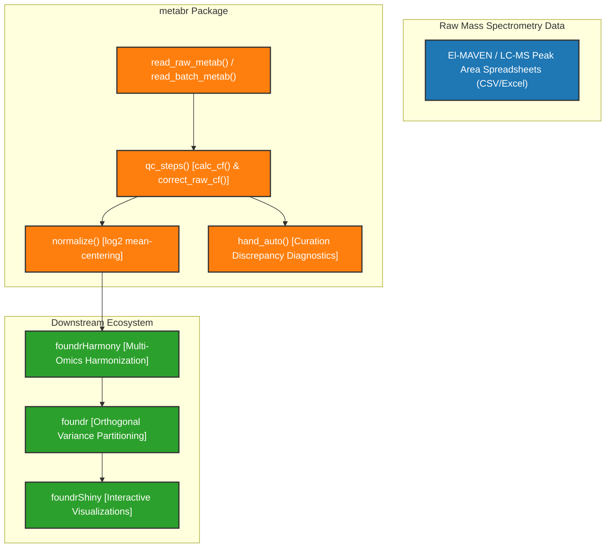

# Developer Guide for metabr

Welcome to the developer guide for **metabr** (v0.2.3), an R package in the `foundr` / systems genetics ecosystem designed for metabolite data ingestion, quality control (QC) batch correction, normalization, and curation discrepancy analysis.

This document details package architecture, data models, developer environment setup, core QC algorithms, S3 class definitions, testing procedures, and release guidelines.

---

## 1. Ecosystem & Package Architecture

`metabr` serves as the metabolite data ingestion and standardization layer. It takes raw peak-area spreadsheets output by El-MAVEN or LC-MS mass spectrometry platforms, applies quality control sample batch corrections across runs/plates/batches, and exports normalized datasets for downstream analysis (`foundrHarmony` $\rightarrow$ `foundr` $\rightarrow$ `foundrShiny`).

### Role in the Systems Genetics Ecosystem



### Key R Functions & Modules

| Module / File | Core Functions | Description |
| --- | --- | --- |
| [`R/qc_steps.R`](file:///Users/brianyandell/Documents/Research/byandell-sysgen/metabr/R/qc_steps.R) | [`qc_steps()`](file:///Users/brianyandell/Documents/Research/byandell-sysgen/metabr/R/qc_steps.R#L10), [`calc_cf()`](file:///Users/brianyandell/Documents/Research/byandell-sysgen/metabr/R/qc_steps.R#L32), [`replace_missing_ave_cf()`](file:///Users/brianyandell/Documents/Research/byandell-sysgen/metabr/R/qc_steps.R#L84), [`correct_raw_cf()`](file:///Users/brianyandell/Documents/Research/byandell-sysgen/metabr/R/qc_steps.R#L112) | Main quality control batch-correction engine using QC pool sample ratios |
| [`R/read_raw_metab.R`](file:///Users/brianyandell/Documents/Research/byandell-sysgen/metabr/R/read_raw_metab.R) | [`read_raw_metab()`](file:///Users/brianyandell/Documents/Research/byandell-sysgen/metabr/R/read_raw_metab.R#L18) | Imports raw LC-MS peak-area tables, pivots traits, extracts `mouse_id`, `run`, `rundate`, `Batch`, `Plate`, `time`, and `rep` |
| [`R/read_batch_metab.R`](file:///Users/brianyandell/Documents/Research/byandell-sysgen/metabr/R/read_batch_metab.R) | [`read_batch_metab()`](file:///Users/brianyandell/Documents/Research/byandell-sysgen/metabr/R/read_batch_metab.R#L18) | Parses previously batch-corrected multi-sheet Excel files |
| [`R/read_metab.R`](file:///Users/brianyandell/Documents/Research/byandell-sysgen/metabr/R/read_metab.R) | [`read_metab_minute()`](file:///Users/brianyandell/Documents/Research/byandell-sysgen/metabr/R/read_metab.R#L12) | Parses minute-specific time-course metabolomics experiments |
| [`R/write_metab.R`](file:///Users/brianyandell/Documents/Research/byandell-sysgen/metabr/R/write_metab.R) | [`write_metab()`](file:///Users/brianyandell/Documents/Research/byandell-sysgen/metabr/R/write_metab.R#L13) | Exports processed long-format metabolite data frame into standard wide CSV files |
| [`R/norm_merge.R`](file:///Users/brianyandell/Documents/Research/byandell-sysgen/metabr/R/norm_merge.R) | [`normalize()`](file:///Users/brianyandell/Documents/Research/byandell-sysgen/metabr/R/norm_merge.R#L10) | Applies compound-wise mean-centering and $\log_2$ transformation |
| [`R/hand_auto.R`](file:///Users/brianyandell/Documents/Research/byandell-sysgen/metabr/R/hand_auto.R) | [`hand_auto()`](file:///Users/brianyandell/Documents/Research/byandell-sysgen/metabr/R/hand_auto.R#L13), [`ggplot_hand_auto()`](file:///Users/brianyandell/Documents/Research/byandell-sysgen/metabr/R/hand_auto.R#L28), [`autoplot.hand_auto()`](file:///Users/brianyandell/Documents/Research/byandell-sysgen/metabr/R/hand_auto.R#L42) | S3 class and ggplot methods to compare manual vs. automated curation ratios |

---

## 2. Developer Environment & Setup

### Prerequisites

- **R Version**: $\ge 3.5.0$
- **R Packages**: `dplyr`, `ggplot2`, `knitr`, `readr`, `purrr`, `stringr`, `tibble`, `tidyr`, `readxl`, `utils`
- **Optional Suggests**: `EnrichmentBrowser`, `OmnipathR`, `pkgdown`

### Development Workflow

```r
# 1. Load active package development session
devtools::load_all()

# 2. Update roxygen2 documentation & NAMESPACE
devtools::document()

# 3. Build local pkgdown site to inspect articles and flowcharts
pkgdown::build_site(install = FALSE)

# 4. Run CRAN / package check
devtools::check(cran = FALSE, vignettes = FALSE)
```

---

## 3. Core Quality Control Methodology

The core operation of `metabr` is plate-level quality control (QC) batch correction driven by [`qc_steps()`](file:///Users/brianyandell/Documents/Research/byandell-sysgen/metabr/R/qc_steps.R#L10).

### Mathematical Correction Formula

For a given compound $c$ (and retention time $\text{medRt}$ for untargeted assays) measured in batch $b$ and plate $p$:

1. **Calculate Plate QC Mean**:
   $$\bar{y}_{b, p, c, \text{QC}} = \frac{1}{N_{\text{QC}}} \sum_{i \in \text{QC}_{b,p}} y_{i, c}$$

2. **Calculate Global Compound QC Mean**:
   $$\bar{y}_{c, \text{QC}} = \frac{1}{N_{\text{total QC}}} \sum_{all \text{ QC}} y_{i, c}$$

3. **Correction Factor (CF)**:
   $$\text{CF}_{b, p, c} = \frac{\bar{y}_{b, p, c, \text{QC}}}{\bar{y}_{c, \text{QC}}}$$

4. **Batch-Corrected Sample Intensity**:
   $$y_{\text{corrected}, i} = \frac{y_{\text{raw}, i}}{\text{CF}_{b, p, c}}$$

---

## 4. Documentation Site & Deployment

The package documentation site is generated via `pkgdown` and automatically deployed to GitHub Pages via GitHub Actions:

- **Site Configuration**: [`_pkgdown.yml`](file:///Users/brianyandell/Documents/Research/byandell-sysgen/metabr/_pkgdown.yml)
- **CI/CD Workflow**: [`.github/workflows/pkgdown.yaml`](file:///Users/brianyandell/Documents/Research/byandell-sysgen/metabr/.github/workflows/pkgdown.yaml)
- **Target Branch**: `gh-pages`
- **Site URL**: `https://byandell-sysgen.github.io/metabr`
