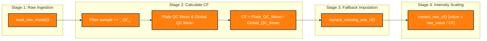
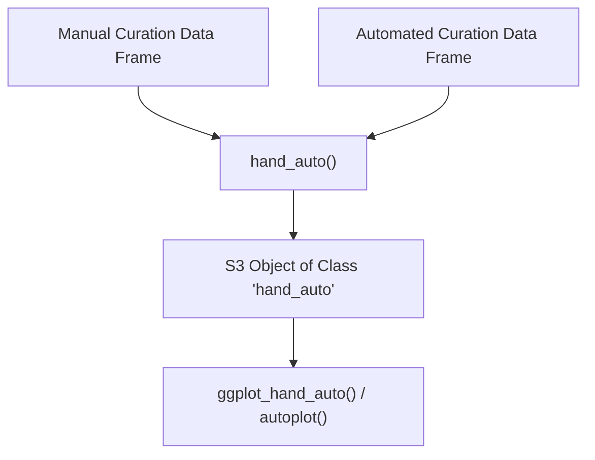

```{r, include = FALSE}
knitr::opts_chunk$set(
  collapse = TRUE,
  comment = "#>"
)
```

# QC Pipeline & Correction Methodology

This document details the quality control (QC) batch-correction algorithm and curation discrepancy analysis implemented in **metabr**.

---

## 1. Quality Control Correction Algorithm

The core pipeline driver [`qc_steps()`](file:///Users/brianyandell/Documents/Research/byandell-sysgen/metabr/R/qc_steps.R#L10) executes a 4-stage batch correction process:



### Mathematical Formulation

1. **Plate QC Average**:
   $$\text{Mean}_{\text{Plate}}(c, \text{medRt}, b, p) = \frac{1}{|\text{QC}_{b,p}|} \sum_{i \in \text{QC}_{b,p}} y_{i, c, \text{medRt}}$$

2. **Global QC Average**:
   $$\text{Mean}_{\text{Global}}(c, \text{medRt}) = \frac{1}{|\text{QC}_{\text{total}}|} \sum_{i \in \text{QC}_{\text{total}}} y_{i, c, \text{medRt}}$$

3. **Plate Correction Factor (CF)**:
   $$\text{CF}_{b, p, c, \text{medRt}} = \frac{\text{Mean}_{\text{Plate}}(c, \text{medRt}, b, p)}{\text{Mean}_{\text{Global}}(c, \text{medRt})}$$

4. **Batch-Corrected Sample Intensity**:
   $$y_{\text{corrected}, i} = \frac{y_{\text{raw}, i}}{\text{CF}_{b, p, c, \text{medRt}}}$$

---

## 2. Retention Time (`medRt`) & Peak Curation

For untargeted metabolomics, LC-MS platforms may output multiple chromatographic peaks per compound corresponding to different retention times.

- **Untargeted Assays**: Grouping is performed across `(compound, medRt)` pairs to ensure each peak is independently corrected.
- **Targeted Assays**: Grouping defaults to `compound` when `medRt` is unique.

---

## 3. Curation Discrepancy Analysis (`hand_auto`)

To evaluate automated QC correction against manual expert curation, [`hand_auto()`](file:///Users/brianyandell/Documents/Research/byandell-sysgen/metabr/R/hand_auto.R#L13) calculates compound-wise ratios across samples:

$$\text{Ratio} = \frac{\text{Value}_{\text{hand}}}{\text{Value}_{\text{auto}}}$$



Visualizing the resulting ratio against automated value estimates ($\log_{10}$ scale) per batch and plate allows rapid detection of systematic curation biases or outlier plates.
